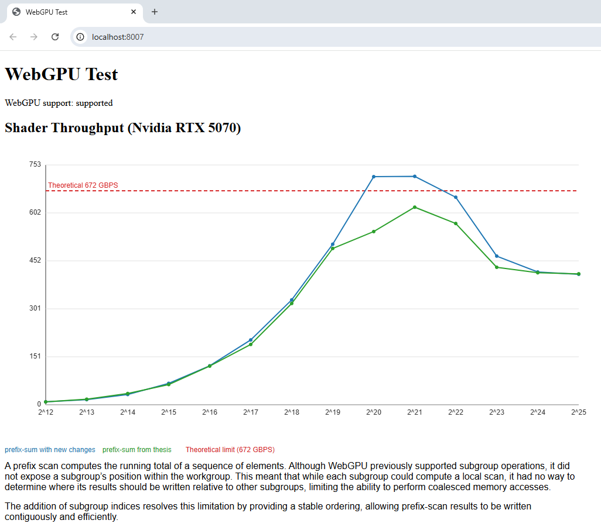

# Single-pass prefix sum: WebGPU and CUDA

A decoupled-lookback inclusive scan over `u32`, in two generations. WebGPU came
first; the CUDA port came afterwards, to put the algorithm against the industry
standard — `cub::DeviceScan::InclusiveSum` — on its own turf.

**v1** is the kernel from [*ScanBox: A Tunable and Portable GPU Prefix Scan
Implementation in Vulkan and WebGPU*](https://jamescontini.com/Thesis.pdf) —
James V. Contini, B.S. Computer Science, UC Santa Cruz, June 2025. **v2** is the
work since, and replaces v1's memory path with a warp-carried scan over coalesced
loads. v2 beats v1 in WebGPU, and in CUDA it beats CUB — see
[Results](#results).

```
webgpu/    WGSL kernels + browser harness      → webgpu/README.md
cuda/      CUDA port + CUB comparison          → cuda/README.md
```

## v1 → v2

Both share the single-pass skeleton — one launch, each block publishing its
aggregate and looking backwards for its exclusive prefix — and two pieces of it
are unchanged from v1:

- **Bit-packed partition state.** Flag and aggregate share one 32-bit word, a
  2-bit flag above a 30-bit value, so one atomic carries both and nothing needs a
  fence to pair them. The cost is a 2^30 cap on the running sum.
- **Parallelised decoupled lookback.** Subgroup 0 reads 32 predecessor partitions
  at once rather than one thread walking them singly: `subgroupAll`/`subgroupAny`
  decide whether that window resolves, the highest lane holding an inclusive
  prefix and every lane above it contribute, and an inclusive subgroup scan
  reduces them — stepping back another 32 when no lane has a full prefix yet.

What v2 changes is how data reaches the ALUs.

**v1** — thread *t* owns the run `my_id + 0 … BATCH_SIZE-1`, so a subgroup's 32
lanes touch 32 separate runs on every step, and the block scan rakes through
shared memory.

**v2** — each subgroup owns a contiguous slab of `32 × BATCH_SIZE` vec4s, and lane
*L* of step *i* reads `base + i·32 + L`: one coalesced transaction per subgroup
per step. Data never passes through shared memory — each step is an exclusive
subgroup scan in registers, with lane 31's inclusive total broadcast forward as
the carry into the next. Shared memory holds only the per-subgroup totals.

**Why not sooner.** That slab base is
`part_id · wg_size · BATCH_SIZE + subgroup_id · (subgroup_size · BATCH_SIZE)` — it
needs an invocation to know *which* subgroup it belongs to. WGSL had subgroup
operations but no `subgroup_id`, so a subgroup could not be given its own region
of the input. v2 exists because that builtin landed.

| | file |
|---|---|
| v1 (ScanBox) | `webgpu/prefix-sum-v1.wgsl` |
| v2 | `webgpu/prefix-sum-v2.wgsl` |
| v2 in CUDA | `cuda/prefix_sum_v2.cuh` |

## WebGPU vs CUDA

Close to one-to-one: subgroup builtins map onto warp intrinsics, and
`subgroupBroadcast` needs a constant lane index in WGSL, which pins both to
32-wide subgroups. Two things exist only to work around WGSL:

| | WGSL | CUDA |
|---|---|---|
| **partition id** | `atomicAdd(&part, 1)` — WebGPU guarantees nothing about workgroup launch order, so a workgroup could spin on a predecessor that was never dispatched. | `blockIdx.x` — blocks dispatch in increasing order, the guarantee CUB's scan also leans on. Drops the atomic, a shared slot and a `__syncthreads()`. |
| **bounds** | `select()` evaluates both arms, so the scratch index is clamped as well as the value masked. | The ternary short-circuits; a plain guard does. |

Also: compile-time sizes are `override` plus injected consts in WGSL and template
parameters in CUDA; WGSL zero-initialises workgroup memory and CUDA does not.

## Results

### 1. v2 beats v1, in WebGPU



On an Nvidia RTX 5070 the coalesced layout leads from 2<sup>19</sup> through
2<sup>24</sup>, widest around 2<sup>20</sup>–2<sup>22</sup>, and clears the card's
672 GB/s line where v1 never reaches it.

### 2. v2 beats CUB, in CUDA

`uint32` inclusive sum, 2<sup>12</sup>–2<sup>25</sup>. CUB ships one fixed policy
rather than tuning per call, so v2 is held to one too:

| | geomean vs CUB |
|---|---|
| one fixed policy — 256 threads, batch 4 | **1.29×** |
| restricted to 2<sup>20</sup> and above | **1.08×** |
| per-size best config (upper bound) | 1.35× |

### 3. One policy is enough

Minimising L1 distance from the per-size best envelope, over block size × batch:

| | geomean vs the per-size best |
|---|---|
| 256 threads, batch 4 | 0.959 |
| batch 4, CTA size free | 0.994 |
| batch 2, CTA size free | 0.889 |
| batch 1, CTA size free | 0.754 |

Items-per-thread carries it; CTA size is a threshold rather than a gradient — 128
and 256 threads sit within 4% of each other. One configuration stays within ~4%
of what per-size tuning could reach, which is what makes the comparison above a
fair one.

### Caveats

Below roughly 2<sup>19</sup> a launch costs more than the kernel, so those sizes
measure per-call overhead rather than scan throughput — it is also why the two
WebGPU curves converge there. The CUDA figures come from one GPU and shift a few
percent on a re-run, the two leading policies swapping places; read them as
magnitudes. Per-size tables and method notes are in `cuda/README.md`.

**What this is not.** A proof of concept, not a library: exactly-tiled `uint32`
inclusive sums only — `N == blocks × threads × batch × 4`, no partial tiles — with
the 2^30 cap above. CUB is generic over element type, operator and size, and
carried that generality through every measurement here.

## Running it

```bash
make cuda-run       # build and run three CUDA sweeps  (about a second)
make cuda-report    # per-size table + the tuning-policy search
make webgpu         # serve the WGSL benchmark, open it in Chrome
```

`make` with no target lists everything; each directory also stands alone.
**Needs** CUDA 13 and an sm_80+ GPU for `cuda/`, Chrome 144+ for `webgpu/`.

## License

MIT — see [LICENSE](LICENSE).
